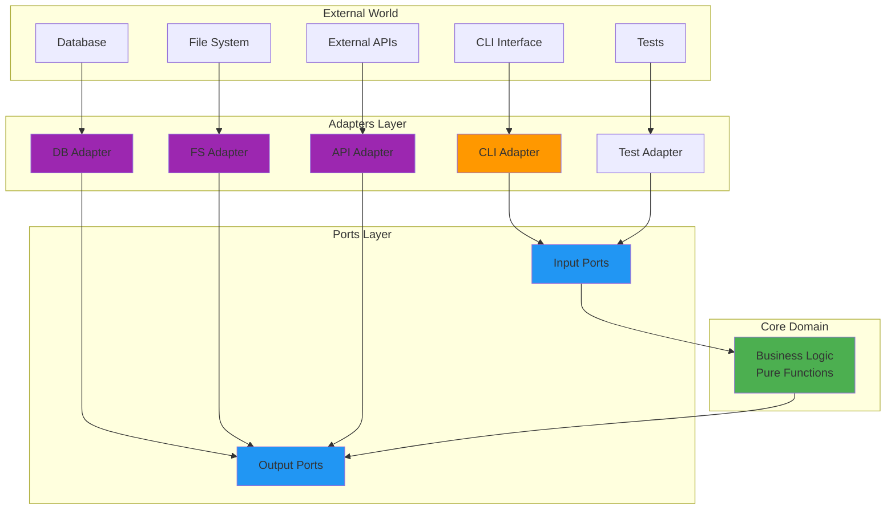

# System Architecture & Engineering Specification

## Table of Contents

1. Purpose & Overview
2. Technology Stack
3. Architectural Principles
4. Layer Structure & Directory Layout
5. Effect-TS Patterns & Functional Services
6. Error Handling Model
7. Ports & Adapters (Domain Interfaces)
8. Local Run Analytics
9. Configuration Handling
10. Plugins & Extensibility
11. Command Catalogue
12. Shell Completions
13. Upgrade Sequence
14. Testing Strategy
15. Extending the System

---

## 1 · Purpose & Overview

`dev` is a **hexagonal**, **plugin-extensible** CLI that streamlines navigation, repo cloning, environment setup and diagnostics.  The design is deeply rooted in *functional programming* and *Effect-TS* best practices.  By treating *services as values* rather than classes, we keep the codebase declarative, composable and trivially testable.

### Key Benefits

* **Testability** – pure business logic isolated from side-effects
* **Maintainability** – strict separation of concerns & clear dependency flow
* **Flexibility** – adapters can be swapped without touching core logic
* **Type-Safety** – full TypeScript compilation with zero errors
* **Resource Safety** – Effect-TS manages lifecycles & interruptions automatically

---

## 2 · Technology Stack

| Concern            | Choice                           | Locked Version |
| ------------------ | -------------------------------- | ------------- |
| Runtime / Compiler | **Bun**                          | 1.2.17        |
| Language           | **TypeScript**                   | 5.8.3         |
| FP Runtime         | **Effect**                       | 3.16.11       |
| Test Runner        | **Vitest**                       | 3.2.4         |
| Relational Store   | **SQLite 3** via **drizzle-orm** | latest        |
| Git CLI            | `git` ≥ 2.40                     | —             |

---

## 3 · Architectural Principles

### 3.1 Hexagonal / Ports & Adapters

Business rules live at the centre, surrounded by *ports* (interfaces) and *adapters* (concrete implementations).



### 3.2 Dependency Rule

*All* arrows point **inwards** – inner layers never import from outer ones.

```
CLI  →  Application  →  Domain
Infra →  Domain
```

---

## 4 · Layer Structure & Directory Layout

```text
src/
├── domain/        # 🏛️ Pure business logic
│   ├── models.ts
│   ├── errors.ts
│   ├── matching.ts
│   ├── ports/
│   └── services/
│
├── app/           # 🔄 Use-cases (commands & app-services)
│   ├── commands/
│   └── services/
│
├── infra/         # 🔌 Adapters (FS, Git, DB, …)
│   ├── fs/
│   ├── git/
│   ├── network/
│   ├── shell/
│   └── db/
│
├── cli/           # 🖥️ CLI parser & wiring
├── config/        # ⚙️ Config schema, loader & migrations
├── effect/        # 🔧 Effect-TS specific helpers (optional)
├── plugins/       # 🧩 Dynamically discovered modules
├── wiring.ts      # 🏗️ Composition root
└── index.ts       # 🚀 Entry point
```

### 4.1 Layer Isolation Rules

| Layer         | Can Import From                 | Must **NOT** Import From |
| ------------- | ------------------------------- | ------------------------ |
| **Domain**    | Effect, other domain modules    | App, Infra, CLI         |
| **App**       | Domain, Effect                  | Infra, CLI               |
| **Infra**     | Domain, Effect, external libs   | App, CLI                 |
| **CLI**       | App, Domain, Effect             | Infra                    |
| **Root**      | Every layer                     | —                        |

### 4.2 Layer Definitions

| Layer         | Services Included                                                      |
| ------------- | ---------------------------------------------------------------------- |
| **InfraLive** | FileSystem, RepoProvider, Mise, Shell, Keychain, Network, **RunStore** |
| **AppLive**   | Config **+ InfraLive**                                  |
| **CliLive**   | Console, Telemetry *(optional)* **+ AppLive**                          |

Tests compose only the layers they need (e.g. swap `FileSystemLive` for an in-memory fake).

---

## 5 · Effect-TS Patterns & Functional Services

Idiomatic Effect focuses on *values* – no classes, no `this`, no hidden state [[see todo-no-classes.md]].

### 5.1 Service Declaration

```ts
// src/domain/ports/Git.ts
export interface Git {
  clone: (repo: Repository, dest: string) => Effect.Effect<void, GitError>;
  currentCommitSha: (cwd?: string) => Effect.Effect<string, GitError>;
}

export const GitTag = Context.Tag<Git>("Git");
```

### 5.2 Functional Adapter (Factory)

```ts
// src/infra/git/GitLive.ts
import { Effect, Layer } from "effect";
import { Git, GitTag } from "../../domain/ports/Git";
import { ShellTag } from "../../domain/ports/Shell";

const makeGitLive = (shell: Shell): Git => ({
  clone: (repo, dest) =>
    shell.exec("git", ["clone", repo.cloneUrl, dest]),

  currentCommitSha: (cwd) =>
    shell.exec("git", ["rev-parse", "HEAD"], { cwd }).pipe(
      Effect.map((r) => r.stdout.trim())
    ),
});

export const GitLiveLayer = Layer.effect(
  GitTag,
  Effect.gen(function* () {
    const shell = yield* ShellTag;
    return makeGitLive(shell);
  })
);
```

No `class`, just a *factory* that returns a plain object implementing `Git`.

### 5.3 Composing Effects

```ts
// Example command (functional style)
export const cloneCommand: CliCommandSpec = {
  name: "clone",
  description: "Clone a repository",
  handler: ({ args }) =>
    Effect.gen(function* () {
      const git = yield* GitTag;
      const repo = parseRepository(args.repo);
      const dest = `${process.env.HOME}/src/${repo.fullName}`;
      yield* git.clone(repo, dest);
    }),
};
```

---

## 6 · Error Handling Model

```ts
export type DevError =
  | { _tag: "ConfigError";   reason: string }
  | { _tag: "GitError";      reason: string }
  | { _tag: "NetworkError";  reason: string }
  | { _tag: "AuthError";     reason: string }
  | { _tag: "ExternalToolError"; message: string; tool?: string; stderr?: string }
  | { _tag: "UnknownError";  reason: unknown };

export const exitCode = (e: DevError): number => ({
  ConfigError:   2,
  GitError:      3,
  NetworkError:  4,
  AuthError:     5,
  ExternalToolError: 6,
  UnknownError:  1,
}[e._tag]);
```

*Never* use `throw`; propagate errors through the Effect error channel.

---

## 7 · Ports & Adapters (Domain Interfaces)

Each port is a pure TypeScript *interface* + a Context Tag.

```ts
// src/domain/ports/FileSystem.ts
export interface FileSystem {
  exists: (path: string) => Effect.Effect<boolean, FileSystemError>;
  readFile: (path: string) => Effect.Effect<string, FileSystemError>;
  writeFile: (path: string, content: string) => Effect.Effect<void, FileSystemError>;
}

export const FileSystemTag = Context.Tag<FileSystem>("FileSystem");
```

Adapters live in `src/infra/**` and are wired in the composition root via **Effect Layers**.

---

## 8 · Local Run Analytics

Drizzle stores command runs in `~/.local/share/dev/dev.db` (following XDG Base Directory Specification).

```ts
import { sqliteTable, text, integer, sql } from "drizzle-orm/sqlite-core";

export const runs = sqliteTable("runs", {
  id:          text().primaryKey(),
  cli_version: text().notNull(),
  command_name:text().notNull(),
  arguments:   text(),
  exit_code:   integer(),
  cwd:         text().notNull(),
  started_at:  integer({ mode: "timestamp" }).notNull(),
  finished_at: integer({ mode: "timestamp" }),
  duration_ms: integer().generatedAlwaysAs(() => sql`finished_at - started_at`),
});
```

A tiny adapter (`RunStoreLive`) inserts a row *before* command execution and finalises it on completion.

---

## 9 · Configuration Handling

`ConfigLoader` reads `~/.config/dev/config.json` (following XDG Base Directory Specification), applies migrations and validation, then provides the resulting object via a Context Tag so that any Effect can simply `yield* ConfigTag`.

```ts
export interface Config {
  version: 3;
  configUrl: string;
  defaultOrg: string;
  paths: { base: string };
  telemetry?: { enabled: boolean };
  plugins?: { git?: readonly string[] };
}

export const ConfigTag = Context.Tag<Config>("Config");
```

### 9.1 Example `config.json` (Schema v3)

```jsonc
{
  "version": 3,
  "configUrl": "https://raw.githubusercontent.com/acme/dev-configs/main/org.json",
  "defaultOrg": "acme",
  "paths": { "base": "~/src" },
  "telemetry": { "enabled": true },
  "plugins": {
    "git": [
      "https://github.com/acme/dev-plugin-docker.git",
      "ssh://git@example.com/custom/dev-plugin-foo.git"
    ]
  }
}
```

*The loader migrates and validates this on startup; `dev upgrade` refreshes it from `configUrl` if the remote version differs.*

---

## 10 · Plugins & Extensibility

Plugins implement an `AppModule` contract.

```ts
export interface AppModule {
  readonly commands: readonly CliCommandSpec[];
  readonly layers?: Layer.Layer<any>;
  readonly hooks?:  { readonly onStart?: Effect.Effect<void> };
}
```

Discovery order:

1. `~/.dev/plugins/**` (local plugins from installation directory)
2. `~/.cache/dev/plugins/**` (cached git plugins - XDG compliant)
3. `node_modules/@*/dev-plugin-*`
4. Git URLs declared in `config.plugins.git`

---

## 11 · Command Catalogue

| Command             | Synopsis                                 |
| ------------------- | ---------------------------------------- |
| **cd**              | `dev cd [name]`                          |
| **clone**           | `dev clone <repo>`                       |
| **up**              | `dev up`                                 |
| **auth**            | `dev auth [svc]`                         |
| **status / doctor** | `dev doctor [--json]`                    |
| **run**             | `dev run <task>`                         |
| **upgrade**         | `dev upgrade [--regenerate-completions]` |
| **help**            | `dev help`                               |

---

## 12 · Shell Completions

`scripts/generate-completions.ts` emits Zsh/Bash/Fish completion scripts to `/completions`.  They can be installed globally or sourced on-the-fly via `eval "$(dev completion zsh)"`.

---

## 13 · Upgrade Sequence

1. Download latest binary.
2. Fetch remote `configUrl`, migrate & overwrite local.
3. Fetch / clone Git plugins declared in config.
4. Regenerate completions if `--regenerate-completions`.
5. Print final version.

---

## 14 · Testing Strategy

### 14.1 Co-located Unit Tests

Place pure unit tests beside the code they test:

```text
src/app/commands/
  ├ clone.ts
  └ clone.test.ts
```

Use in-memory fakes to avoid I/O.

### 14.2 Integration & E2E Suites

```
tests/
├─ integration/
└─ e2e/
```

Integration tests wire multiple layers together with real SQLite; E2E drives the compiled CLI in a temp directory.

---

## 15 · Extending the System

### Adding a New Command

1. **Define / reuse domain models & ports**.
2. **Implement functional adapter(s)** if new infrastructure is needed.
3. **Write the command** as a pure Effect value.
4. **Wire** everything in `wiring.ts`.

### Adding a New Infrastructure Adapter (Example: Redis Cache)

```ts
// 1. Extend error types
export interface CacheError extends DevError { _tag: "CacheError" }

// 2. Domain port
export interface Cache {
  get: (key: string) => Effect.Effect<string | null, CacheError>;
  set: (key: string, value: string, ttl?: number) => Effect.Effect<void, CacheError>;
}
export const CacheTag = Context.Tag<Cache>("Cache");

// 3. Functional adapter factory
const makeRedisCache = (client: RedisClient): Cache => ({
  get: (k) => Effect.promise(() => client.get(k)),
  set: (k, v, ttl) => Effect.promise(() => client.set(k, v, "EX", ttl ?? 60)),
});

export const CacheLayer = Layer.effect(
  CacheTag,
  Effect.gen(function* () {
    const client = createRedisClient();
    return makeRedisCache(client);
  })
);
```

That's it — the system remains *pure*, *composable* and *idiomatically Effect-TS*.
