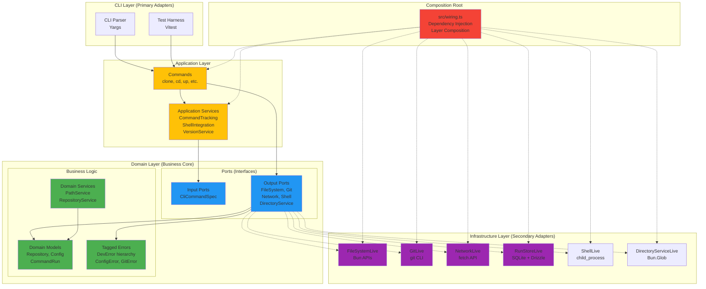
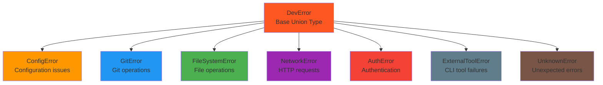
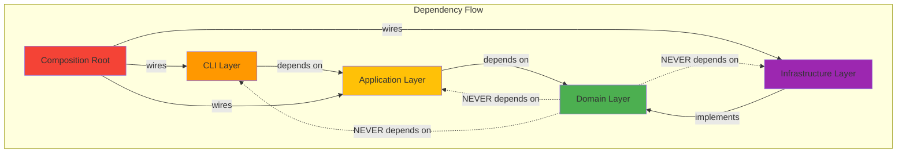
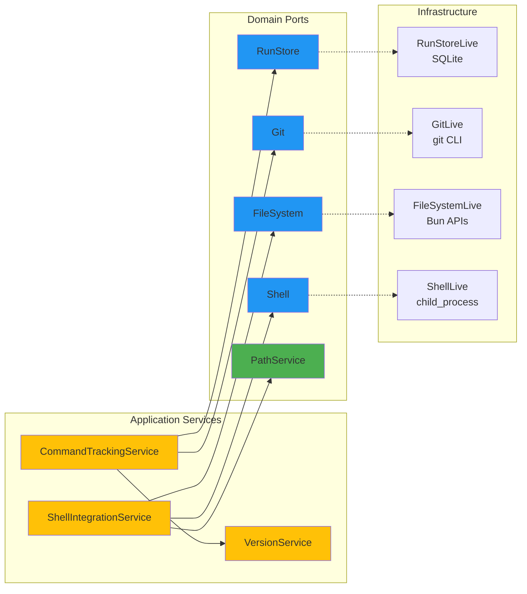

# Architecture Documentation

## Table of Contents

1. [Overview](#overview)
2. [Hexagonal Architecture Principles](#hexagonal-architecture-principles)
3. [Layer Structure](#layer-structure)
4. [Effect-TS Patterns](#effect-ts-patterns)
5. [Error Handling](#error-handling)
6. [Dependency Flow](#dependency-flow)
7. [Directory Structure](#directory-structure)
8. [Testing Strategy](#testing-strategy)
9. [Extending the System](#extending-the-system)
10. [Common Patterns](#common-patterns)

## Overview

This CLI application follows **Hexagonal Architecture** (also known as **Ports & Adapters**) principles, implemented with **Effect-TS** for functional programming patterns. The architecture ensures clean separation of business logic from external concerns like databases, file systems, and external APIs.

### Key Benefits

- **Testability**: Easy to test business logic in isolation
- **Maintainability**: Clear separation of concerns
- **Flexibility**: Easy to swap implementations (e.g., different databases)
- **Type Safety**: Full TypeScript compilation with zero errors
- **Functional Programming**: Idiomatic Effect-TS patterns throughout

## Hexagonal Architecture Principles

### Core Concept

The application is structured as concentric layers, with business logic at the center and external concerns at the edges. Dependencies flow **inward** toward the domain core.

```mermaid
graph TB
    subgraph "External World"
        CLI[CLI Interface]
        DB[Database]
        FS[File System]
        API[External APIs]
        Tests[Tests]
    end

    subgraph "Adapters Layer"
        CLIAdapter[CLI Adapter]
        DBAdapter[DB Adapter]
        FSAdapter[FS Adapter]
        APIAdapter[API Adapter]
        TestAdapter[Test Adapter]
    end

    subgraph "Ports Layer"
        InputPort[Input Ports]
        OutputPort[Output Ports]
    end

    subgraph "Core Domain"
        Business[Business Logic<br/>(Pure Functions)]
    end

    CLI --> CLIAdapter
    DB --> DBAdapter
    FS --> FSAdapter
    API --> APIAdapter
    Tests --> TestAdapter

    CLIAdapter --> InputPort
    DBAdapter --> OutputPort
    FSAdapter --> OutputPort
    APIAdapter --> OutputPort
    TestAdapter --> InputPort

    InputPort --> Business
    Business --> OutputPort

    style Business fill:#4CAF50
    style InputPort fill:#2196F3
    style OutputPort fill:#2196F3
    style CLIAdapter fill:#FF9800
    style DBAdapter fill:#9C27B0
    style FSAdapter fill:#9C27B0
    style APIAdapter fill:#9C27B0
```

### Dependency Rule

**Dependencies point inward**: Outer layers depend on inner layers, never the reverse.

- ✅ **Application** depends on **Domain**
- ✅ **Infrastructure** depends on **Domain**
- ❌ **Domain** never depends on **Application** or **Infrastructure**

## Layer Structure

### Complete Architecture Overview



### 1. Domain Layer (Core Business Logic)

**Location**: `src/domain/`

The heart of the application containing pure business logic with zero external dependencies.

#### Domain Models

```typescript
// src/domain/models.ts
export interface Repository {
  readonly name: string;
  readonly org: string;
  readonly provider: GitProviderType;
  readonly fullName: string;
}

export interface Config {
  version: 3;
  configUrl: string;
  defaultOrg: string;
  paths: { base: string };
  // ... more config
}
```

#### Domain Ports (Interfaces)

```typescript
// src/domain/ports/FileSystem.ts
export interface FileSystem {
  exists(path: string): Effect.Effect<boolean, FileSystemError>;
  readFile(path: string): Effect.Effect<string, FileSystemError>;
  writeFile(path: string, content: string): Effect.Effect<void, FileSystemError>;
  mkdir(path: string, recursive?: boolean): Effect.Effect<void, FileSystemError>;
}
```

#### Tagged Errors

```typescript
// src/domain/errors.ts
export class ConfigError extends Data.TaggedError("ConfigError")<{
  readonly reason: string;
}> {}

export class GitError extends Data.TaggedError("GitError")<{
  readonly reason: string;
  readonly command?: string;
}> {}
```

### 2. Application Layer (Use Cases)

**Location**: `src/app/`

Orchestrates domain objects to implement application use cases. Contains no business rules, only coordination logic.

#### Commands (Use Cases)

```typescript
// src/app/commands/clone.ts
export const cloneCommand: CliCommandSpec = {
  name: "clone",
  description: "Clone a repository",
  handler: (context: CommandContext) =>
    Effect.gen(function* () {
      // Orchestrate domain services
      const git = yield* GitService;
      const fileSystem = yield* FileSystemService;
      const pathService = yield* PathServiceTag;

      // Pure coordination logic - no business rules
      const repository = yield* parseRepository(context.args.repo);
      const targetPath = pathService.resolveDestinationPath(repository);

      yield* git.clone(repository, targetPath);
    })
};
```

#### Application Services

```typescript
// src/app/services/CommandTrackingService.ts
export class CommandTrackingServiceImpl implements CommandTrackingService {
  recordCommandRun(): Effect.Effect<string, ConfigError | UnknownError, any> {
    return Effect.gen(function* () {
      const runStore = yield* RunStoreService;
      const versionService = yield* VersionServiceTag;
      const git = yield* GitService;

      // Coordinate multiple domain services
      const version = yield* versionService.getCurrentVersion();
      const gitSha = yield* git.getCurrentCommitSha().pipe(
        Effect.catchAll(() => Effect.succeed("unknown"))
      );

      return yield* runStore.record({
        command: process.argv.slice(2).join(" "),
        version,
        gitSha,
        startedAt: new Date(),
      });
    });
  }
}
```

### 3. Infrastructure Layer (External Concerns)

**Location**: `src/infra/`

Implements domain ports using concrete technologies. Contains all external dependencies.

#### Infrastructure Adapters

```typescript
// src/infra/fs/FileSystemLive.ts
export class FileSystemLive implements FileSystem {
  exists(path: string): Effect.Effect<boolean, FileSystemError> {
    return Effect.tryPromise({
      try: () => Bun.file(path).exists(),
      catch: (error) => fileSystemError(`Failed to check existence: ${error}`)
    });
  }

  readFile(path: string): Effect.Effect<string, FileSystemError> {
    return Effect.tryPromise({
      try: async () => {
        const file = Bun.file(path);
        return await file.text();
      },
      catch: (error) => fileSystemError(`Failed to read file: ${error}`)
    });
  }
}
```

### 4. Composition Root

**Location**: `src/wiring.ts`

The only place where concrete implementations are wired together. Handles dependency injection.

```typescript
// src/wiring.ts
export const InfraLiveLayer = Layer.mergeAll(
  FileSystemLiveLayer,
  GitLiveLayer,
  NetworkLiveLayer,
  // ... other infrastructure layers
);

export const AppLiveLayer = Layer.mergeAll(
  InfraLiveLayer,
  CommandTrackingServiceLive,
  ShellIntegrationServiceLive,
  // ... other app services
);
```

## Effect-TS Patterns

### Why Effect-TS?

Effect-TS provides:

- **Type-safe error handling** without exceptions
- **Composable effects** for complex async operations
- **Dependency injection** through Context
- **Resource management** with automatic cleanup

### Core Patterns Used

#### 1. Effect.gen for Async Composition

```typescript
// Instead of async/await with try/catch
export const cloneRepository = (repo: Repository, path: string) =>
  Effect.gen(function* () {
    const git = yield* GitService;
    const fileSystem = yield* FileSystemService;

    const exists = yield* fileSystem.exists(path);
    if (exists) {
      yield* Effect.fail(configError("Directory already exists"));
    }

    yield* git.clone(repo, path);
  });
```

#### 2. Dependency Injection via Context

```typescript
// Services are injected automatically
export class FileSystemLiveLayer extends Context.Tag("FileSystem")<
  FileSystemService,
  FileSystem
>() {}

// Usage in effects
const useFileSystem = Effect.gen(function* () {
  const fs = yield* FileSystemService; // Automatically injected
  return yield* fs.readFile("config.json");
});
```

#### 3. Error Channel Usage

```typescript
// Errors flow through the error channel, not exceptions
const readConfig = fileSystem.readFile("config.json").pipe(
  Effect.catchTag("FileSystemError", (error) =>
    Effect.fail(configError(`Config not found: ${error.reason}`))
  )
);
```

## Error Handling

### Tagged Error Hierarchy



### Error Handling Patterns

#### Never Use `throw`

```typescript
// ❌ DON'T: Traditional exception throwing
function badReadFile(path: string): string {
  if (!fs.existsSync(path)) {
    throw new Error("File not found"); // Breaks Effect composition
  }
  return fs.readFileSync(path, "utf8");
}

// ✅ DO: Use Effect error channel
function goodReadFile(path: string): Effect.Effect<string, FileSystemError> {
  return Effect.tryPromise({
    try: () => Bun.file(path).text(),
    catch: (error) => fileSystemError(`Failed to read file: ${error}`)
  });
}
```

#### Error Transformation

```typescript
// Transform infrastructure errors to domain errors
const networkToConfigError = (error: NetworkError): ConfigError =>
  configError(`Network issue while loading config: ${error.reason}`);

const loadRemoteConfig = network.get(configUrl).pipe(
  Effect.mapError(networkToConfigError),
  Effect.flatMap(response => parseConfig(response.body))
);
```

## Dependency Flow

### Layer Dependencies



### Service Dependencies



## Directory Structure

```
src/
├── domain/                     # 🏛️ Business Logic Core
│   ├── models.ts              # Domain entities & value objects
│   ├── errors.ts              # Tagged error hierarchy
│   ├── matching.ts            # Business rules for repo matching
│   ├── ports/                 # Interfaces for external dependencies
│   │   ├── FileSystem.ts      # File operations interface
│   │   ├── Git.ts             # Git operations interface
│   │   ├── Network.ts         # HTTP operations interface
│   │   ├── Shell.ts           # Shell command interface
│   │   ├── DirectoryService.ts # Directory management interface
│   │   └── DebugService.ts    # Debug configuration interface
│   └── services/              # Domain services (business logic)
│       ├── PathService.ts     # Path resolution logic
│       └── RepositoryService.ts # Repository business rules
│
├── app/                       # 🔄 Application Use Cases
│   ├── commands/              # CLI command handlers
│   │   ├── clone.ts           # Clone repository use case
│   │   ├── cd.ts              # Change directory use case
│   │   ├── up.ts              # Project setup use case
│   │   └── ...
│   └── services/              # Application orchestration services
│       ├── CommandTrackingService.ts  # Track command execution
│       ├── ShellIntegrationService.ts # Shell integration logic
│       └── VersionService.ts          # Version management
│
├── infra/                     # 🔌 Infrastructure Adapters
│   ├── fs/                    # File system implementations
│   │   ├── FileSystemLive.ts  # Bun file system adapter
│   │   └── DirectoryService.ts # Directory scanning implementation
│   ├── git/                   # Git implementations
│   │   └── GitLive.ts         # Git CLI adapter
│   ├── network/               # Network implementations
│   │   └── NetworkLive.ts     # Fetch API adapter
│   ├── shell/                 # Shell implementations
│   │   └── ShellLive.ts       # Child process adapter
│   ├── db/                    # Database implementations
│   │   └── RunStoreLive.ts    # SQLite + Drizzle adapter
│   └── tools/                 # External tool adapters
│       ├── mise.ts            # Mise tool management
│       └── gcloud.ts          # Google Cloud CLI management
│
├── cli/                       # 🖥️ CLI Interface
│   ├── parser.ts              # Yargs CLI parser
│   └── wiring.ts              # CLI-specific wiring
│
├── config/                    # ⚙️ Configuration Management
│   ├── schema.ts              # Configuration schema
│   ├── loader.ts              # Configuration loading logic
│   └── migrations/            # Config migration logic
│
├── effect/                    # 🔧 Effect-TS Extensions
│   ├── Clock.ts               # Time service implementation
│   └── LoggerLive.ts          # Logging service implementation
│
├── wiring.ts                  # 🏗️ Composition Root
└── index.ts                   # 🚀 Application Entry Point
```

### Layer Isolation Rules

| Layer | Can Import From | Cannot Import From |
|-------|-----------------|-------------------|
| **Domain** | Effect, other domain modules | App, Infrastructure, CLI |
| **Application** | Domain, Effect | Infrastructure, CLI |
| **Infrastructure** | Domain, Effect, external libs | Application, CLI |
| **CLI** | Application, Domain, Effect | Infrastructure |
| **Composition Root** | All layers | None (imports everything) |

## Testing Strategy

### Unit Testing with Effect

```typescript
// Test domain logic in isolation
describe("PathService", () => {
  test("resolves destination path correctly", async () => {
    const config: Config = {
      paths: { base: "/dev" },
      // ... other config
    };

    const pathService = new PathServiceImpl();
    const repository: Repository = {
      name: "myrepo",
      org: "myorg",
      provider: "github",
      fullName: "myorg/myrepo"
    };

    const result = pathService.resolveDestinationPath(repository, config);
    expect(result).toBe("/dev/myorg/myrepo");
  });
});
```

### Integration Testing with Test Doubles

```typescript
// Create test implementations of ports
class TestFileSystem implements FileSystem {
  private files = new Map<string, string>();

  exists(path: string): Effect.Effect<boolean, FileSystemError> {
    return Effect.succeed(this.files.has(path));
  }

  readFile(path: string): Effect.Effect<string, FileSystemError> {
    const content = this.files.get(path);
    return content
      ? Effect.succeed(content)
      : Effect.fail(fileSystemError("File not found"));
  }
}

// Test application logic with controlled dependencies
describe("Clone Command", () => {
  test("clones repository successfully", async () => {
    const testFS = new TestFileSystem();
    const testGit = new TestGit();

    const testLayer = Layer.mergeAll(
      Layer.succeed(FileSystemService, testFS),
      Layer.succeed(GitService, testGit)
    );

    const program = cloneCommand.handler({
      args: { repo: "myorg/myrepo" }
    });

    const result = await Effect.runPromise(
      Effect.provide(program, testLayer)
    );

    expect(result).toEqual(/* expected result */);
  });
});
```

## Extending the System

### Adding a New Command

1. **Create Domain Models** (if needed)

```typescript
// src/domain/models.ts
export interface NewFeature {
  readonly id: string;
  readonly name: string;
}
```

2. **Create Domain Port** (if needed)

```typescript
// src/domain/ports/NewService.ts
export interface NewService {
  doSomething(input: string): Effect.Effect<NewFeature, DevError>;
}
```

3. **Implement Infrastructure Adapter**

```typescript
// src/infra/newservice/NewServiceLive.ts
export class NewServiceLive implements NewService {
  doSomething(input: string): Effect.Effect<NewFeature, DevError> {
    return Effect.tryPromise({
      try: () => someExternalAPI.call(input),
      catch: (error) => unknownError(`API call failed: ${error}`)
    });
  }
}
```

4. **Create Application Command**

```typescript
// src/app/commands/newcommand.ts
export const newCommand: CliCommandSpec = {
  name: "new",
  description: "Does something new",
  handler: (context) => Effect.gen(function* () {
    const newService = yield* NewServiceTag;
    const result = yield* newService.doSomething(context.args.input);
    console.log(`Result: ${result.name}`);
  })
};
```

5. **Wire Everything Together**

```typescript
// src/wiring.ts
export const AppLiveLayer = Layer.mergeAll(
  InfraLiveLayer,
  NewServiceLive, // Add the new service
  // ... existing services
);

// Add to available commands
export const availableCommands = [
  // ... existing commands
  newCommand, // Add the new command
];
```

### Adding a New Infrastructure Adapter

For example, adding Redis support:

1. **Extend Domain Error Types**

```typescript
// src/domain/errors.ts
export class CacheError extends Data.TaggedError("CacheError")<{
  readonly reason: string;
}> {}
```

2. **Create Domain Port**

```typescript
// src/domain/ports/Cache.ts
export interface Cache {
  get(key: string): Effect.Effect<string | null, CacheError>;
  set(key: string, value: string, ttl?: number): Effect.Effect<void, CacheError>;
}
```

3. **Implement Redis Adapter**

```typescript
// src/infra/cache/CacheLive.ts
export class CacheLive implements Cache {
  constructor(private client: RedisClient) {}

  get(key: string): Effect.Effect<string | null, CacheError> {
    return Effect.tryPromise({
      try: () => this.client.get(key),
      catch: (error) => cacheError(`Redis get failed: ${error}`)
    });
  }
}
```

4. **Add to Composition Root**

```typescript
// src/wiring.ts
const CacheLayer = Layer.effect(
  CacheService,
  Effect.gen(function* () {
    const redisClient = createRedisClient();
    return new CacheLive(redisClient);
  })
);

export const InfraLiveLayer = Layer.mergeAll(
  BaseInfraLayer,
  CacheLayer, // Add cache layer
  // ... other layers
);
```

## Common Patterns

### Pattern 1: Service Composition

```typescript
// Compose multiple services for complex operations
export const setupProject = Effect.gen(function* () {
  const git = yield* GitService;
  const fileSystem = yield* FileSystemService;
  const shell = yield* ShellService;
  const mise = yield* MiseService;

  // Step 1: Clone repository
  yield* git.clone(repository, targetPath);

  // Step 2: Setup development environment
  yield* mise.ensureVersionOrUpgrade();

  // Step 3: Install dependencies
  yield* shell.exec("bun", ["install"], { cwd: targetPath });

  // Step 4: Create initial config
  yield* fileSystem.writeFile(
    `${targetPath}/.env`,
    "NODE_ENV=development\n"
  );
});
```

### Pattern 2: Error Recovery

```typescript
// Graceful error handling with fallbacks
export const loadConfig = Effect.gen(function* () {
  const fileSystem = yield* FileSystemService;
  const network = yield* NetworkService;

  // Try to load local config first
  const localConfig = yield* fileSystem
    .readFile("config.json")
    .pipe(
      Effect.flatMap(parseConfig),
      Effect.catchTag("FileSystemError", () =>
        Effect.succeed(null) // Ignore if file doesn't exist
      )
    );

  if (localConfig) {
    return localConfig;
  }

  // Fallback to remote config
  return yield* network
    .get("https://api.example.com/config")
    .pipe(
      Effect.flatMap(response => parseConfig(response.body)),
      Effect.catchAll(() =>
        Effect.succeed(defaultConfig) // Ultimate fallback
      )
    );
});
```

### Pattern 3: Resource Management

```typescript
// Automatic resource cleanup with Effect.gen
export const processLargeFile = (filePath: string) =>
  Effect.gen(function* () {
    const fileSystem = yield* FileSystemService;

    // Resource is automatically cleaned up
    yield* Effect.acquireUseRelease(
      fileSystem.openFile(filePath), // Acquire
      (file) => processFile(file),    // Use
      (file) => fileSystem.closeFile(file) // Release
    );
  });
```

---

## Conclusion

This architecture provides a robust, maintainable, and testable foundation for the CLI application. The hexagonal architecture ensures business logic remains isolated from external concerns, while Effect-TS provides type-safe, composable patterns for handling complexity.

Key takeaways:

- **Business logic is pure** and isolated in the domain layer
- **All external concerns** are abstracted behind ports
- **Effect-TS patterns** eliminate exceptions and provide composability
- **Dependency injection** makes testing and extension straightforward
- **Clear layer separation** makes the codebase maintainable and understandable

For questions or clarifications about this architecture, refer to the individual source files or the Effect-TS documentation.
