# Mise Upgrade Process

This document describes the enhanced mise version management and upgrade process implemented in the dev CLI tool.

## Overview

The dev CLI requires a minimum version of mise to ensure compatibility with all features. When a command requires mise, the system automatically checks the installed version and handles upgrades seamlessly with an improved user experience.

## Upgrade Flow

The following diagram illustrates the complete upgrade flow:

```mermaid
graph TD
    A["User runs command<br/>requiring mise"] --> B{"Check mise<br/>version"}
    B -->|Version OK| C["Continue with command"]
    B -->|Version too old| D["Show version comparison<br/>e.g. 2025.5.2 → 2025.6.0"]
    B -->|Not installed| E["Show missing mise error"]

    D --> F["Start mise upgrade<br/>with progress streaming"]
    E --> F

    F --> G{"Network<br/>error?"}
    G -->|Yes| H["Retry with backoff<br/>Show attempt counter"]
    G -->|No| I{"Upgrade<br/>success?"}

    H -->|Max retries| J["Show manual<br/>upgrade instructions"]
    H -->|Retry| F

    I -->|Yes| K["Show upgraded version<br/>e.g. 2025.5.2 → 2025.6.0"]
    I -->|No| J

    K --> L["Verify new version<br/>meets requirement"]
    L -->|Yes| C
    L -->|No| M["Show PATH/install<br/>troubleshooting tips"]

    style A fill:#e1f5fe
    style C fill:#c8e6c9
    style J fill:#ffcdd2
    style K fill:#c8e6c9
    style M fill:#ffcdd2
```



## Key Features

### 🚀 Real-time Progress Streaming

During the upgrade process, users see:

- Progress indicators with meaningful status messages
- Filtered output showing only important updates (downloading, installing, completion)
- Live streaming of the upgrade process
- Clear success/failure indicators

### 📊 Visual Version Comparison

The system provides clear version information:

- Current version vs. required version
- Visual upgrade path (e.g., `2025.5.2 → 2025.6.0`)
- Status indicators (upgrade needed, up to date, newer than required)

### 🔄 Automatic Retry Logic

Network failures are handled gracefully:

- Up to 3 retry attempts by default
- Exponential backoff between retries (2s, 4s, 6s)
- Clear indication of retry attempts
- Network error detection and specific messaging

### 🛠️ Helpful Error Recovery

When upgrades fail, users receive:

- Specific manual upgrade instructions for their installation method
- PATH troubleshooting tips for version conflicts
- Links to official documentation
- Context-specific error messages

## Debug Mode

Enable debug mode with `DEV_CLI_DEBUG=true` to see:

- Raw mise version output
- Detailed version extraction process
- Full error stack traces
- Configuration file previews
- Command exit codes and stderr output

## Implementation Details

### Version Checking

```typescript
// Version comparison uses semantic versioning
compareVersions("2025.5.2", "2025.6.0") // returns -1 (older)
compareVersions("2025.6.0", "2025.6.0") // returns 0 (equal)
compareVersions("2025.7.0", "2025.6.0") // returns 1 (newer)
```

### Upgrade Process

1. **Check Current Version**: Parse mise version output
2. **Compare Versions**: Determine if upgrade is needed
3. **Stream Upgrade**: Use Bun's streaming APIs for real-time output
4. **Verify Success**: Check new version after upgrade
5. **Handle Failures**: Provide recovery instructions

### Error Handling

- **Network Errors**: Automatic retry with backoff
- **Permission Errors**: Suggest permission fixes
- **PATH Issues**: Help identify multiple installations
- **Unknown Errors**: Fallback to manual upgrade instructions

## User Experience Examples

### Successful Upgrade

```shell
⚠️  Mise version 2025.5.2 is older than required 2025.6.0
   2025.5.2 → 2025.6.0 (upgrade needed)
🚀 Starting mise upgrade...
⏳ Updating mise... (this may take a moment)
   Downloading mise 2025.6.0...
   Installing mise 2025.6.0...
✅ Mise updated successfully to version 2025.6.0
✨ Mise successfully upgraded: 2025.5.2 → 2025.6.0
```

### Network Failure with Retry

```shell
⚠️  Mise version 2025.5.2 is older than required 2025.6.0
🚀 Starting mise upgrade...
⏳ Updating mise... (this may take a moment)
⚠️  Network error during update (attempt 1/3)
🔄 Retry attempt 2/3...
⏳ Updating mise... (this may take a moment)
   Downloading mise 2025.6.0...
✅ Mise updated successfully to version 2025.6.0
```

### Manual Upgrade Required

```shell
❌ Failed to update mise to required version
💡 Try manually upgrading mise:
   • If installed via Homebrew: brew upgrade mise
   • If installed via curl: curl https://mise.run | sh
   • Visit: https://mise.jdx.dev/getting-started.html
```

## Configuration Setup

The system also handles mise configuration with improved feedback:

- Shows number of tools being configured
- Displays configuration file location
- Provides next steps guidance
- Includes debug mode for configuration details
