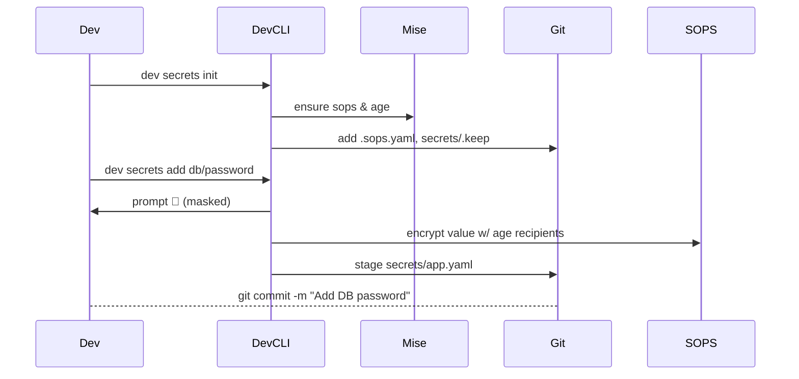
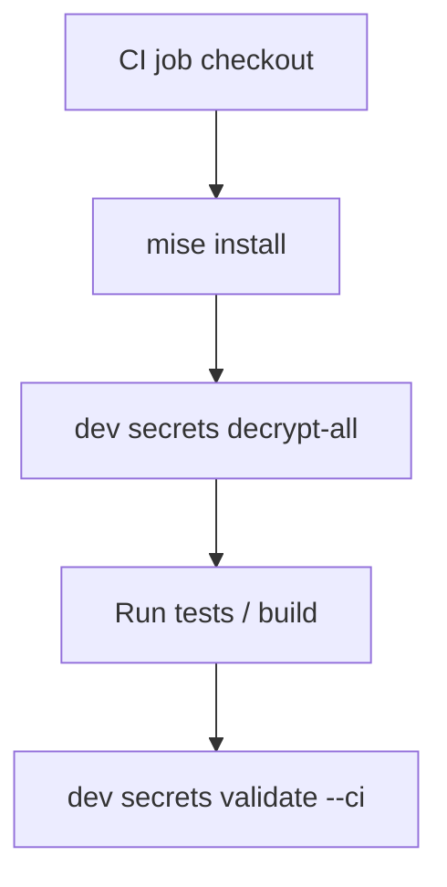

# `dev` CLI — Secrets Management Specification

> **Version:** 0.9-draft · **Date:** 2025-06-08
> **Authors:** Dev Platform Engineering

---

## 1 Motivation

Modern teams need a **single, developer-friendly workflow** to:

* keep small (< 60 KB) secrets (JSON / YAML / text / certs / binary blobs) version-controlled with their code,
* review changes in PRs with meaningful, line-level diffs,
* stay secure (zero plain-text at rest),
* work offline, and
* promote secrets to CI/CD and Cloud runtimes (Google Cloud Secret Manager, GCSM).

`dev secrets` brings these goals to every repo with **three guiding principles**:

1. **“Git first.”** Secrets live next to the code that needs them.
2. **“Encrypt last-mile only.”** We encrypt *values*, not whole files, so diffs stay readable.
3. **“One-liner UX.”** Common tasks should be a single `dev secrets …` invocation, with sane defaults and a guided TUI when needed.

---

## 2 Key Components

| Layer                    | Tooling                         | Why                                                                                   |
| ------------------------ | ------------------------------- | ------------------------------------------------------------------------------------- |
| Encryption engine        | **SOPS v3+**                    | Proven, diff-friendly structured encryption (JSON/YAML).                              |
| Cipher                   | **age**                         | Modern, simple, small, supports both X25519 recipients and plug-in KMS (**GCP KMS**). |
| Runtime installer        | **mise** (`.tool-versions`)     | Ensures every contributor & CI runs same versions of `sops`, `age`, `dev`.            |
| Cloud backend (optional) | **Google Cloud Secret Manager** | Authoritative store for production; `dev secrets sync` bridges Git↔︎GCSM.             |

---

## 3 Repo Layout

```
repo/
├─ .tool-versions         # managed by mise
├─ .sops.yaml             # repo-level SOPS policy
├─ .dev/                  # hidden meta
│  ├─ secrets/            # decrypted scratch space (git-ignored)
│  └─ keys/               # age key per contributor (optional)
└─ secrets/               # ***encrypted*** sources, committed
   ├─ app.yaml            # mixed YAML / env
   ├─ certs.json          # PEM, DER, etc.
   └─ binary.b64          # base64-encoded blobs ≤ 60 KB
```

*Anything under `secrets/` is encrypted and safe to commit; everything under `.dev/secrets/` is unencrypted and listed in `.gitignore`.*

---

## 4 `.sops.yaml` Policy

```yaml
creation_rules:
  # Default: age recipients live in ./secrets/recipients.txt
  - path_regex: 'secrets/.*'
    encrypted_regex: '^(data|stringData|value)$'
    age: &recipients
      - 'age1…teamkey1'
      - 'age1…teamkey2'
    kms: []
    pgp: []
    format: yaml
```

* Only **leaf values** matching `encrypted_regex` are cipher-texts; keys, comments, and structure stay diff-able.
* Policy keeps one SOPS metadata header per file (small one-line diff when recipients rotate).

---

## 5 CLI Surface

```
dev secrets <subcommand> [flags]

Primary workflow
  init           # one-time: adds .sops.yaml, scaffolds secrets/
  edit  <file>   # opens decrypted temp copy in $EDITOR, re-encrypts on save
  view  <file>   # cat decrypted contents
  diff  <rev>    # human-readable diff between two git refs
  add   <key> [--from-file|-f] [--binary]   # create/update entry
  rm    <key>    # delete entry
  list           # tree view of secrets/
  rotate-keys    # add/remove age recipients repo-wide

Automation & CI
  decrypt-all    # bulk decrypt into .dev/secrets/ ; used by dev containers
  sync [gcp]     # bidirectional sync with Google Cloud Secret Manager
  validate       # CI gate: file size ≤ 60 KB, no unencrypted leaks
  export-env     # emit `export FOO=` lines, useful for `eval $(dev secrets export-env)`

Plumbing (rare)
  exec  [--] cmd…   # run command with secrets injected as env vars
  reencrypt         # re-run sops update (e.g., after policy change)
```

### Flag conventions

* `--json`, `--yaml`, `--binary` override auto-detection.
* All subcommands accept `--namespace/-n` to scope to logical secret sets (see §6.1).
* `--mount=path` places decrypted files in custom location for Docker/K8s builds.

---

## 6 User Flows (Mermaid)

### 6.1 Happy path — first secret in a new repo



### 6.2 CI decryption



---

## 7 Diff Strategy

| Scenario                | Git Diff outcome                                                     |
| ----------------------- | -------------------------------------------------------------------- |
| Add/remove key          | One-line insertion/deletion in file.                                 |
| Change JSON/YAML scalar | Only that line’s ciphertext changes (base64 chunk \~100 chars).      |
| Rotate recipients       | Header line `sops: >` changes once per file.                         |
| Binary secret           | Diff shows a *binary diff* marker; reviewers rely on commit message. |

> **Tip:** Encourage teams to keep each secret in its own small file to further localize changes.

---

## 8 Key Management

* Project owners maintain an **age X25519 team key** in `secrets/recipients.txt`.
* Each developer creates their own keypair (`age-keygen -o ~/.config/age/key.txt`), then runs:

```
dev secrets rotate-keys --add $(cat ~/.config/age/key.txt | grep pub:)
```

`rotate-keys` touches every file once, creating a single automated PR.

* **CI robots** use a GCP KMS key as a recipient (`age-plugin-gcpkms://projects/…`), so no disk-stored keys in CI.

---

## 9 Google Cloud Secret Manager Sync

| Direction     | Command                   | Auth method                                             |
| ------------- | ------------------------- | ------------------------------------------------------- |
| Git → GCSM    | `dev secrets sync --push` | Workstation’s gcloud creds (impersonate CI-svc-acct).   |
| GCSM → CI env | `dev secrets sync --pull` | Workload Identity; writes decoded files to disk or env. |

* Each secret path maps to `projects/$PROJECT/secrets/$REPO-$PATH`.
* Metadata (labels) include git SHA and repo URL for traceability.
* `sync --prune` deletes GCSM versions that disappeared from git (opt-in).

---

## 10 DX niceties

| Feature            | Detail                                                                                           |
| ------------------ | ------------------------------------------------------------------------------------------------ |
| **Auto-install**   | `dev secrets` checks `$PATH`, runs `mise install` if `sops`/`age` missing or wrong version.      |
| **TUI editor**     | When `$EDITOR` is `nano`/`vim`/`helix`, displays HUD with decrypted file path + live size check. |
| **Human diffs**    | `dev secrets diff` pipes to `delta`/`git diff --color` for local readability.                    |
| **Shell hook**     | `eval "$(dev secrets export-env --shell)"` in `.envrc` / `.zshrc` for zero-friction local usage. |
| **File templates** | `dev secrets add --from-template=gcp-service-account` scaffold common JSON shapes.               |

---

## 11 Constraints & Validation Rules

| Rule                                  | Enforcement                                                        |
| ------------------------------------- | ------------------------------------------------------------------ |
| ≤ 60 KB per secret                    | Hard limit in `validate`; CI fails on oversize.                    |
| No plaintext secrets in git           | `pre-commit` hook scans staged changes with regex / entropy check. |
| Only UTF-8 filenames under `secrets/` | Prevents CI path issues.                                           |
| Binary secrets must be base64         | Auto-wraps at 76 chars for diff-ability.                           |
| SOPS metadata version pinned          | `.sops.yaml` sets `version: 3.8.x` for reproducibility.            |

---

## 12 Security Considerations

* **Confidentiality:** age encryption with forward secrecy.
* **Integrity:** Git SHA + SOPS MAC.
* **Access auditing:** All GCSM reads logged in Cloud Audit; local decrypts logged to `.dev/secrets/.audit.log` (opt-in).
* **Key rotation:** Monthly cadence via `dev secrets rotate-keys --kms-roll` (rotates GCP KMS key version).
* **Supply-chain safety:** `mise` pins checksums of sops/age binaries; `dev secrets validate --ci` verifies.

---

## 13 Open Questions / Future Work

1. **Secret search**: fuzzy finder across decrypted content?
2. **Hierarchical namespaces** beyond per-repo, e.g., mono-repo sub-projects.
3. **Merge conflict resolver**: interactive 3-way tool for encrypted files.
4. **Automatic stale-secret pruning** after N days of unused references.

---

## 14 Glossary

| Term              | Meaning                                                               |
| ----------------- | --------------------------------------------------------------------- |
| **Age recipient** | Public key (or KMS URI) that can decrypt a secret.                    |
| **SOPS**          | “Secrets OPerationS”, tool that encrypts individual JSON/YAML values. |
| **GCSM**          | Google Cloud Secret Manager.                                          |
| **Namespace**     | Logical prefix within `secrets/` (e.g., `dev/`, `prod/`).             |

---

## 15 Summary

`dev secrets` marries **git-native workflows** with **best-practices encryption** and **cloud-grade rotation**.
Developers run *one* command, reviewers see *one-line* diffs, CI/CD receives *just-in-time* plaintext—all without leaking a single byte.

> *“Great DX is invisible security.”*
