# `dev` CLI — **Secrets Management**

**Version 0.9-draft · 2025-06-08**

---

## Table of Contents

- [`dev` CLI — **Secrets Management**](#dev-cli--secrets-management)
  - [Table of Contents](#table-of-contents)
  - [1 — Executive summary](#1--executive-summary)
  - [2 — Problem \& objectives](#2--problem--objectives)
  - [3 — Goals \& non-goals](#3--goals--non-goals)
  - [4 — Guiding principles](#4--guiding-principles)
  - [5 — High-level architecture](#5--high-level-architecture)
  - [6 — Canonical repository layout](#6--canonical-repository-layout)
  - [7 — Encryption policy](#7--encryption-policy)
  - [8 — `dev secrets` CLI surface](#8--dev-secrets-cli-surface)
  - [9 — Typical user flows](#9--typical-user-flows)
    - [9.1 Happy path (add first secret)](#91-happy-path-add-first-secret)
    - [9.2 CI job](#92-ci-job)
  - [10 — Diff \& size strategy](#10--diff--size-strategy)
  - [11 — Key management lifecycle](#11--key-management-lifecycle)
  - [12 — Google Cloud Secret Manager sync](#12--google-cloud-secret-manager-sync)
  - [13 — CI / CD integration](#13--ci--cd-integration)
  - [14 — Validation \& guard-rails](#14--validation--guard-rails)
  - [15 — Developer-experience niceties](#15--developer-experience-niceties)
  - [16 — Security considerations](#16--security-considerations)
  - [17 — Open questions / future work](#17--open-questions--future-work)
  - [18 — Glossary](#18--glossary)
    - [**TL;DR**](#tldr)

---

## 1 — Executive summary

`dev secrets` gives every repository a **first-class, Git-native, diff-friendly** workflow for managing secrets of up to 60 KB (JSON / YAML / text / certs / small binaries). It combines **SOPS + age** encryption, optional **Google Cloud Secret Manager** promotion, and a **one-liner UX** backed by **mise** to guarantee reproducible tooling versions.

---

## 2 — Problem & objectives

| # | Problem                                                   | Objective                                                       |
| - | --------------------------------------------------------- | --------------------------------------------------------------- |
| 1 | Secrets scattered across vaults, env-files, CI variables. | Keep secrets **next to the code** that needs them.              |
| 2 | Entire files re-encrypted on edit ⇒ unreadable PRs.       | Encrypt **only leaf values** so reviewers see meaningful diffs. |
| 3 | Local setup & CI break when tool versions drift.          | **Auto-install** exact versions of `sops`, `age`, `dev`.        |
| 4 | Production wants authoritative secrets in GCP.            | Enable **bidirectional Git ↔ GCSM sync**.                       |
| 5 | Teams use mono-repos with multiple environments.          | Provide **namespaces & env directories** that scale.            |

---

## 3 — Goals & non-goals

| Goals                                                            | Non-goals                                                  |
| ---------------------------------------------------------------- | ---------------------------------------------------------- |
| 🔐 End-to-end secret confidentiality with zero plaintext in Git. | Replace enterprise vaults for > 60 KB objects.             |
| 🏷️ Line-level diffs in PRs.                                     | Handle secrets > 100 KB (kube configs, large cert chains). |
| 🛠️ One approach for dev laptops, CI containers, prod clusters.  | Be a general-purpose config management system.             |
| ☁️ Optional promotion to Google Cloud Secret Manager.            | Support every possible cloud KMS (focus on GCP).           |

---

## 4 — Guiding principles

1. **Git-first.** Secrets live in the repo, versioned with code.
2. **Encrypt the leaves.** Structure stays visible; only values become ciphertext.
3. **One command, sane defaults.** Common tasks fit in a single `dev secrets …`.
4. **Config lives in `.config/dev/`.** No clutter at repo root, follows XDG spirit.
5. **Scratch is disposable.** Decrypted artefacts never enter `git add -A`.

---

## 5 — High-level architecture

| Layer                    | Technology                      | Rationale                                           |
| ------------------------ | ------------------------------- | --------------------------------------------------- |
| Encryption engine        | **SOPS v3**                     | Mature, JSON/YAML aware, diff-friendly.             |
| Cipher                   | **age + age-plugin-gcpkms**     | Modern, small, forward-secret; native GCP KMS URIs. |
| Runtime installer        | **mise** (`.tool-versions`)     | Reproducible versions for dev & CI.                 |
| Secrets backend (opt-in) | **Google Cloud Secret Manager** | Authoritative store for runtime environments.       |

---

## 6 — Canonical repository layout

```text
repo/
├─ .tool-versions               # managed by mise
├─ .sops.yaml                   # global encryption policy
├─ .config/
│  └─ dev/
│     ├─ policy.yaml            # optional CLI overrides
│     ├─ recipients.txt         # PUBLIC age recipients (team & robots)
│     ├─ keys/                  # PRIVATE age keys (git-ignored)
│     └─ scratch/               # decrypted temp files (git-ignored)
└─ secrets/
   ├─ common/                   # cross-env values (rare)
   │   └─ redis.yaml
   ├─ dev/
   │   ├─ api.yaml
   │   └─ queue.json
   └─ prod/
       ├─ api.yaml
       ├─ queue.json
       └─ certs.pem.b64
```

*Anything under `secrets/` is encrypted & committed; anything under `.config/dev/scratch/` is plaintext & **ignored**.*

---

## 7 — Encryption policy

**`.sops.yaml`** — encrypt only the values we care about.

```yaml
creation_rules:
  - path_regex: '^secrets/.*'
    encrypted_regex: '^(data|stringData|value)$'  # leaf scalars
    age:
      - 'age1…teamkey1'
      - 'age1…teamkey2'
      - 'age-plugin-gcpkms://projects/…/cryptoKeys/…/…'
    format: yaml
    kms: []   # we rely on age-plugin-gcpkms
    pgp: []
```

*Rotating recipients rewrites only a **single header line** per file.*

---

## 8 — `dev secrets` CLI surface

```
dev secrets <subcommand> [flags]

Bootstrap
  init                 # scaffold .config/dev + secrets/common
  rotate-keys          # add/remove age recipients repo-wide

CRUD
  add    <key> [--from-file|-f] [--binary]
  edit   <file>
  view   <file>
  rm     <key>
  list   [--tree]

Diff & audit
  diff  <rev>
  validate             # size ≤60 KB, grep for plaintext leaks

Automation
  decrypt-all          # bulk decrypt to .config/dev/scratch
  exec  [--] cmd…      # run command w/ secrets injected
  export-env           # print `export FOO=` lines
  sync  [gcp] [--push|--pull|--prune]

House-keeping
  scratch --purge      # wipe decrypted temp dir
```

*All subcommands accept:* `--namespace/-n <env>`, `--json|--yaml|--binary`, `--mount <path>`.

---

## 9 — Typical user flows

### 9.1 Happy path (add first secret)

```mermaid
sequenceDiagram
  participant Dev
  participant DevCLI as dev secrets
  participant Mise
  Dev->>DevCLI: dev secrets init
  DevCLI->>Mise: ensure tools
  DevCLI->>Git: add .sops.yaml, .config/dev/…
  Dev->>DevCLI: dev secrets add prod/db.password
  DevCLI->>Dev: prompt 🔑
  DevCLI->>SOPS: encrypt leaf
  DevCLI->>Git: stage secrets/prod/api.yaml
  Dev-->Git: git commit -m "Add DB password"
```



### 9.2 CI job


---

## 10 — Diff & size strategy

| Scenario           | Git diff result                                              |
| ------------------ | ------------------------------------------------------------ |
| Change YAML scalar | One-line ciphertext delta (≈ 100 chars).                     |
| Add / rm key       | Minimal insert / delete lines.                               |
| Rotate recipients  | Header line only.                                            |
| Binary (base64)    | Diff limited to changed block; reviewers rely on commit msg. |

**Hard limit:** 60 KB *pre-encrypt* ⇒ \~ 72 KB ciphertext. Validation fails otherwise.

---

## 11 — Key management lifecycle

1. Developer generates key:
   `age-keygen -o ~/.config/age/key.txt`
2. Add public part to repo:
   `dev secrets rotate-keys --add "$(grep pub ~/.config/age/key.txt)"`
3. CI/robots use **GCP KMS** URIs as recipients; no disk keys.
4. Monthly rotation:
   `dev secrets rotate-keys --kms-roll` (updates KMS key version + rewrites headers).

Private keys **never** live inside the repository.

---

## 12 — Google Cloud Secret Manager sync

| Direction  | Command                                             | Notes                                   |
| ---------- | --------------------------------------------------- | --------------------------------------- |
| Git → GCSM | `dev secrets sync --push`                           | Uses `gcloud` creds / impersonation.    |
| GCSM → Git | `dev secrets sync --pull`                           | Useful for bootstrap of legacy secrets. |
| CI runtime | `dev secrets sync --pull --out .config/dev/scratch` | Workload Identity auth.                 |

Secret names:
`projects/$PROJECT/secrets/$REPO-$ENV-$PATH_WITHOUT_EXTENSION`
Labels: `repo`, `sha`, `env`.

---

## 13 — CI / CD integration

```yaml
# .github/workflows/test.yml  (example)
steps:
  - uses: actions/checkout@v4
  - run: mise install          # pin tools
  - run: dev secrets decrypt-all
  - run: ./gradlew test
  - run: dev secrets validate --ci
  - run: dev secrets sync --push --env=prod   # only on main
```

Containerised builds mount `repo/.config/dev/scratch/` read-only into the build context.

---

## 14 — Validation & guard-rails

| Rule                                          | Enforced by                                    |
| --------------------------------------------- | ---------------------------------------------- |
| ≤ 60 KB per secret file                       | `dev secrets validate` (in CI & pre-commit).   |
| No plaintext high-entropy strings in Git diff | Built-in scanner (entropy + regex heuristics). |
| UTF-8 filenames only                          | `validate`.                                    |
| SOPS metadata pinned to version 3.8.x         | `validate`.                                    |
| `recipients.txt` must match `.sops.yaml`      | `validate`.                                    |

Pre-commit hook template:

```bash
#!/usr/bin/env bash
dev secrets validate --staged || {
  echo "❌  Secret validation failed"; exit 1; }
```

---

## 15 — Developer-experience niceties

* **Auto-install**: Missing `sops`/`age` → transparent `mise install`.
* **Smart editor HUD**: When `$EDITOR` is `vim`/`nano`/`helix`, show decrypted path & live size counter.
* **`dev secrets diff`**: Pipes to `git diff --color` / `delta`.
* **Shell hook**: `eval "$(dev secrets export-env --shell)"` for zero-friction local runs.
* **Templates**: `--from-template=gcp-service-account`, `--from-template=jwt`.
* **Scratch cleaner**: `scratch --purge` wipes decrypted debris on logout.

---

## 16 — Security considerations

| Vector                 | Mitigation                                                                                     |
| ---------------------- | ---------------------------------------------------------------------------------------------- |
| **Source-code leak**   | Ciphertext only in Git; leaf encryption prevents accidental plaintext commits.                 |
| **Compromised laptop** | Private keys outside repo; scratch dir purged daily (`tmpfiles.d`).                            |
| **Replay or tamper**   | SOPS MAC verifies integrity; Git SHA pinning.                                                  |
| **Key compromise**     | Monthly rotation cadence; easy `rotate-keys`.                                                  |
| **Audit trail**        | `dev secrets` logs decrypt events to `.config/dev/.audit.log` (opt-in) & Cloud Audit for GCSM. |

---

## 17 — Open questions / future work

1. Interactive **merge-conflict resolver** for encrypted YAML.
2. Secret **search & grep** across decrypted scratch (fzf integration).
3. **Namespace delegation** for huge mono-repos (`packages/foo/.config/dev`).
4. **Automatic stale-secret pruning** after N days of unused references.

---

## 18 — Glossary

| Term                | Definition                                                            |
| ------------------- | --------------------------------------------------------------------- |
| **age**             | “Actually Good Encryption”; modern, small, opinionated file cipher.   |
| **SOPS**            | “Secrets OPerationS”; encrypts individual values in structured files. |
| **GCSM**            | Google Cloud Secret Manager.                                          |
| **Namespace / env** | Directory under `secrets/` (`dev/`, `staging/`, `prod/`).             |
| **Recipients**      | Public keys (age) or KMS URIs that can decrypt a secret.              |
| **Scratch dir**     | Local, git-ignored folder for decrypted artefacts.                    |

---

### **TL;DR**

*Repo layout:*

```
config → .config/dev/           # tooling & keys
state  → .config/dev/scratch/   # decrypted, ignored
secrets → secrets/(env)/…       # encrypted, committed
```

`dev secrets` delivers **Git-first, diff-friendly, cloud-ready** secret management in a single, ergonomic command set—securing your stack without slowing anyone down.
